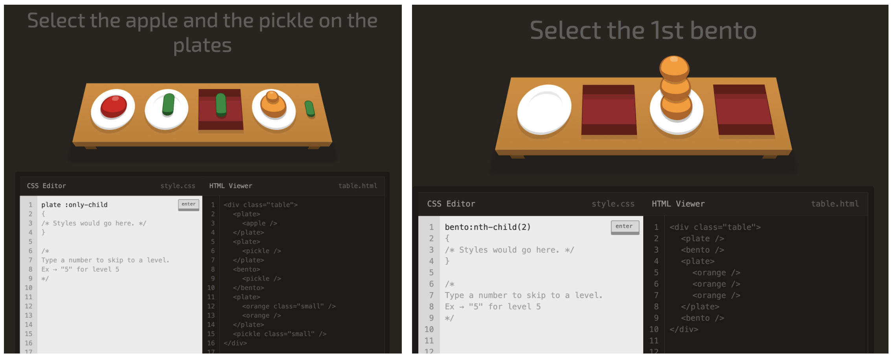

# 11/03 요약
- HTML
- CSS

## 오늘 한 일
1. Korea Startup Forum 홈페이지 마크업 해보기

2. HTML 수업
- 테이블 태그 : table, tr, th, td, colspan, rowspan 등
- 블록 레벨 요소와 인라인 요소

3. CSS 수업
- CSS 문법 : selector, property, value
- CSS 적용 방식 : 인라인 방식, 내부 스타일 시트, 외부 스타일 시트
- RESET CSS
- 공백처리, 주석, 벤더 프리픽스
- 🌟 CSS selector : type, class, id, 복합 선택자, 속성 선택자, 가상 클래스 선택자, 가상 요소 선택자, 우선순위

4. [CSS Diner](https://flukeout.github.io)에서 오늘 배운 CSS selector 복습

* 몰랐던 것 정리
  - only-child : selects an element that are the only element inside of another one.
  - first-of-type : selects the first element of that type within another element.
  - 다음 사진들은 완벽히 이해하지 못한 것들..
  

## 오늘 배운/느낀 것
- 슬슬 몰랐던 내용이 많아지고 있다. 특히 CSS 복합 선택자, 속성 선택자 쯤부터 뇌가 어질어질..🤪 복습을 잘 해야겠다.
- 오늘부터 오후에 DJ를 하는데 재밌다. 노래 제목 문의가 많이 들어올 때 뿌듯 😌

## 내일 할 일
- CSS Diner : level 21부터 끝까지 풀기
