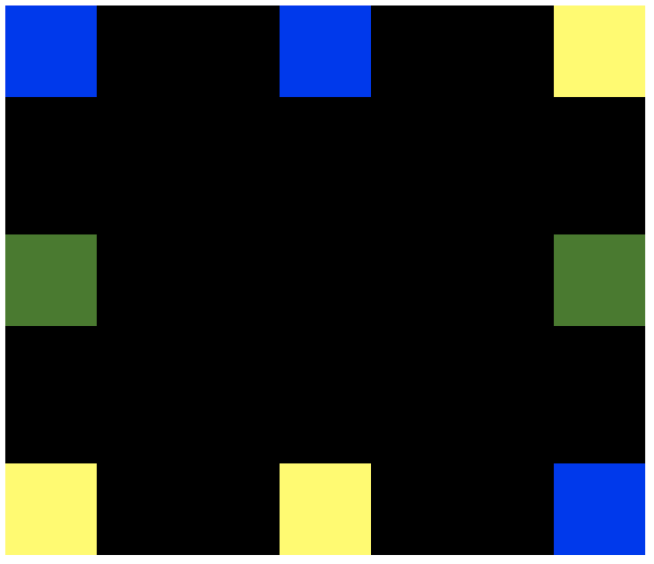

# 11/05 요약
- HTML
- CSS

## 오늘 한 일
1. CSS 수업
- Box Model : display 등
- Position : normal flow, sticky 등
- Float : overflow, clear, clear-fix 등
- Flex : flex-direction, justify-content 등
2. HTML, CSS 수업
- float 이용해서 다음 화면 만들기

- float 이용해서 네이버 로그인 창 레이아웃 만들기 

- float 이용해서 다음 화면 만들기

## 오늘 배운/느낀 것
- Float가 어려웠는데 어제 처음 배우고 오늘 활용해 보니까 조금 이해가 간다. "한 번 배운 것은 배우지 않은 것이다"!!

## 주말동안 할 일
- 이번주에 배운 것 복습 (노션 필기 정리 등)
- 워크샵 때 계획했던 HTML Living Standard 포스팅 작성