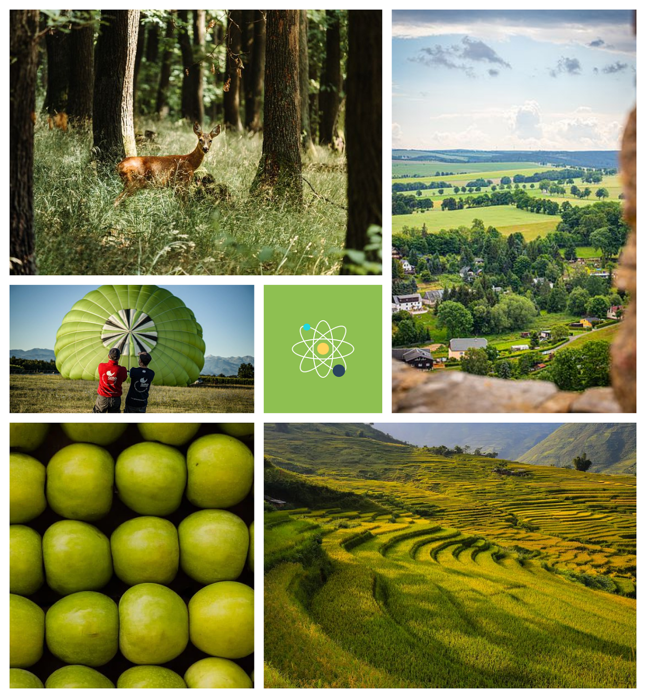

# 11/08 요약
- HTML
- CSS

## 오늘 한 일
1. CSS 수업 (한재현 강사님)
- Flex : align-items, align-content, flex-wrap, flex-basis, flex-grow, flex-shrink, align-self, order
- Grid : template row/column, repeat, gap, grid-row/column-start/end
- Grid 활용 실습 : 아래 화면 만들기

2. HTML, CSS 수업 (이호준 강사님)
- 레이아웃 구현 프로젝트
3. 스프린트 회고 (임동준 강사님) : 액션 플랜 점검, 수정

## 오늘 배운/느낀 것
- flex의 세부 사항을 설정할 수 있는 기능이 다양하다는 것을 배웠다.
- 월요일+비=헤어나올 수 없는 피곤의 구렁텅이.. 3-4시 이후부터는 항상 집중력이 안좋다. 집중력을 어떻게 기를 수 있을까? 그리고 수업이 끝나면 항상 피곤해서 복습만 해도 힘든데 과제 나오면 어떨지 벌써 걱정된다 😨 하지만 어떻게든 해낼거임 물론

## 내일 할 일
- 다음 스프린트 회고(11/22)까지의 목표로 설정한 이력서 개발하기