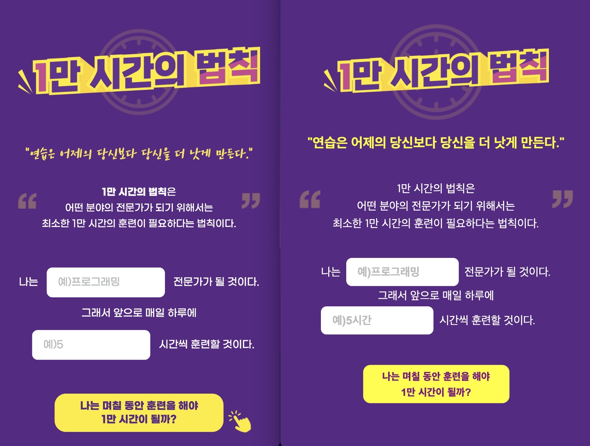

# 11/10 요약
- HTML
- CSS

## 오늘 한 일
1. CSS 수업 (이호준 강사님)
- Animation, Perspective 실습 : 나만의 button 만들기, 카드 뒤집기
- 미디어쿼리 : 논리연산자 등
- 미디어쿼리 실습 : 반응형 웹 제작 (1만 시간의 법칙) -> 다 하진 못 했지만 깃헙에 푸시해놨다.
- 코드컨벤션
2. 이수진님 특강
- 해외취업

1만 시간의 법칙(左-원래 사이트, 右-내가 클론코딩한 사이트)

## 오늘 배운/느낀 것
- '천하제일 버튼 경진대회'가 열렸는데, 너무 멋지게 잘 한 분들이 정말 많아서 놀랐다. 그냥 현업 프론트엔드 개발자 같다. 잘 하는 것도 잘 하는 거지만 이렇게 대회에 열정적으로 참여하는 모습들이 대단하다. 나는 수업 따라가는 것만 해도 벅차서 그냥 적당히 했는데.. 😅
- 다음 회고 때까지 만들 사이트 나머지 하나는 Grid를 활용한 계산기로 정했다.
- 멋쟁이사자처럼 폴더가 점점 지저분해지고 있다.. 정리를 해야 하는데..!

## 내일 할 일
- Resume, Calculator 조금이라도 짜고 깃헙 커밋 & 푸시