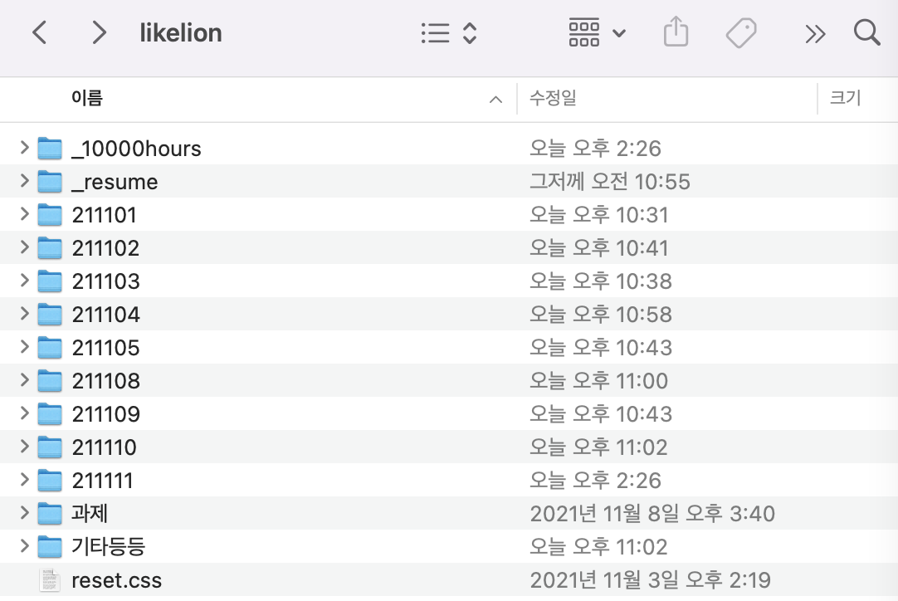

# 11/11 요약
- HTML
- CSS

## 오늘 한 일
1. HTML, CSS 수업 (한재현 강사님)
- 미디어쿼리 복습 : 미디어쿼리 조건, 레티나 대응 등
- '1만 시간의 법칙' 실습

2. 개인 목표 : Resume 짜고 커밋 & 푸시 완료

3. 멋쟁이사자처럼 폴더 정리 완료! 휴 기분 좋다

## 오늘 배운/느낀 것
- 허접하더라도 만들어 보는 것이 중요하다는 것을 깨달았다. 어제 1만 시간의 법칙 페이지를 쓰레기처럼(?) 만들어놨는데, 강사님이 똑같은 페이지를 짜는 과정을 지켜보며 마크업 설계를 어떻게 하는지 훨씬 효과적으로 배울 수 있었다!

## 내일 할 일
- Resume, Calculator 짜고 커밋 & 푸시 완료