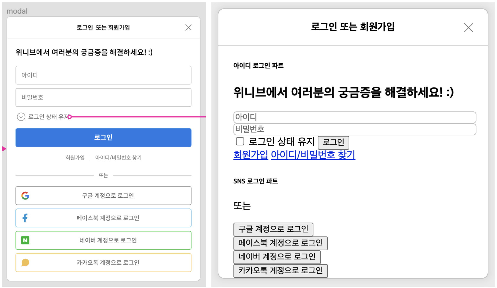
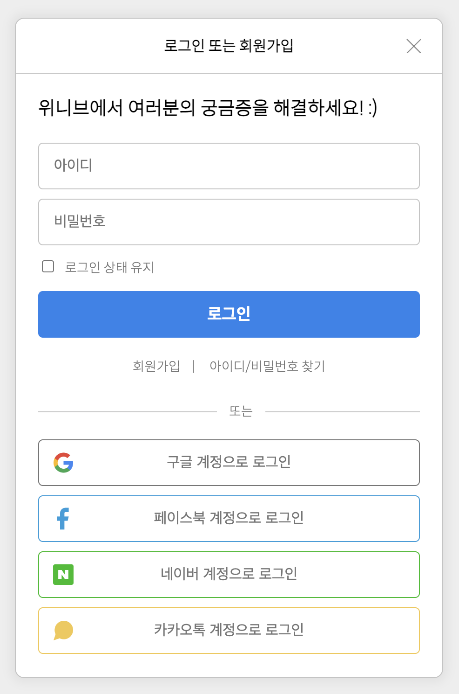

# 11/12 요약
- HTML
- CSS

## 오늘 한 일
1. CSS 수업 (한재현 강사님)
- 1만 시간의 법칙 : 남은 부분 구현
- CSS 설계 기법 : OOCSS, SMACSS, BEM

2. 퍼블리셔, 프론트엔드 차이 알아보기

3. 프론트엔드 개발자 채용공고 분석

4. 실습 : 위니브 로그인 모달 구현

左 - 로그인 모달 figma, 右 - 로그인 모달 구현 현황

## 오늘 배운/느낀 것
- 채용공고를 보고 회사의 상태를 파악할 수 있는지 몰랐다. 채용공고 분석 시간 정말 유익하고 재밌었다 :D
- 프론트엔드 개발이 재밌어서 다행이다. 일로 하면 힘들지도 모르지만, 개발하는 것 자체는 재밌다!

## 주말동안 할 일
- 로그인 모달 구현 완료
- Resume, Calculator 짜기
- 지금까지 배운 것 복습

11/13 구현 현황! 체크박스 빼고 다 했다.
