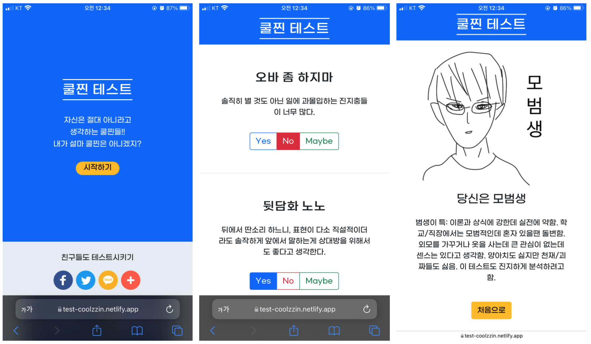

# 11/17 요약
- 조코딩님 특강 : 쿨찐 테스트 만들기

## 오늘 한 일
1. HTML, CSS로 웹페이지 화면 만들기 : Bootstrap 활용

2. JavaScript로 결과 페이지 이동 로직 구현하기 : 아직 멋사에서 js 진도를 나가지 않아 조코딩님이 짠 코드를 활용했다.

3. SNS 공유 기능 넣기 : AddThis 활용

4. 배너 광고 넣기 : Kakao Adfit 활용

5. 만든 페이지 배포하기 : Netlify 활용

6. DNS 구매하기 : Gabia 활용 (후에 gabia, netlify를 연결)

7. 네이버 웹마스터도구 등록하기 : robots.txt 생성, 사이트맵 생성 등

8. SEO 최적화하기

내가 만든 쿨찐 테스트

- https://test-coolzzin.netlify.app/
- DNS 도메인 구매 외의 모든 단계를 수행했다.

## 오늘 배운/느낀 것
- 모든 단계를 차근차근 세심하게 밟아나간 것은 아니지만, 하루동안 만든 내 웹페이지 결과물을 보니 뿌듯하다. 이렇게 웹페이지 하나를 만들고 배포하는 단계를 알았으니, 나중에도 내가 원하면 웹페이지를 만들 수 있다는 자신감이 생긴다.
- 이런 재미를 위한 테스트 웹도 잘 만들면 일주일에 천만원이라는 수익을 올릴 수 있다는 사실이 놀랍다..!

## 내일 할 일
- Resume, Calculator 짜기