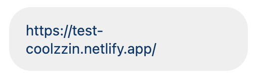
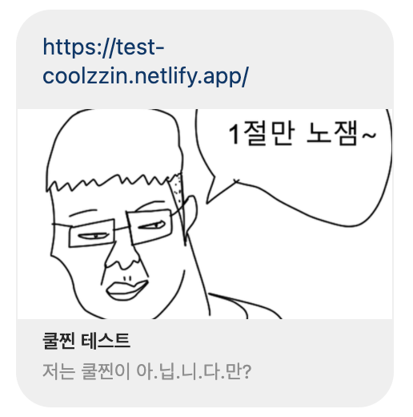

# 11/18 요약
- HTML
- CSS

## 오늘 한 일
1. HTML, CSS 수업 (이호준 강사님)
- CSS animation
- 벤딩머신 레이아웃 만들기 실습

2. 쿨찐 테스트 디벨롭 (개인) (https://test-coolzzin.netlify.app/)
- OpenGraph : 공유할 때 사이트 사진, 설명 뜨게 변경
- imgbb : open graph meta tag에 올리는 사진은 인터넷에 올라와 있어야 해서 (로컬 파일 X) 사용한 무료 웹호스팅 사이트

OpenGraph 적용 전 (인스타 DM)

OpenGraph 적용 후 (인스타 DM)

## 오늘 배운/느낀 것
- 쿨찐 테스트의 카카오 애드핏 광고가 승인돼서 open graph를 붙여서 지인들에게 공유하려 했는데, 이 간단한 과정에서도 오류가 많았다. 처음에는 로컬 파일을 사용해서 안되고, 그 다음에는 imgbb의 주소를 잘못 넣어서 안되고 등등.. 오늘도 "해 보는 것"의 중요성을 많이 깨달았다.

## 내일 할 일
- Resume, Calculator 짜기