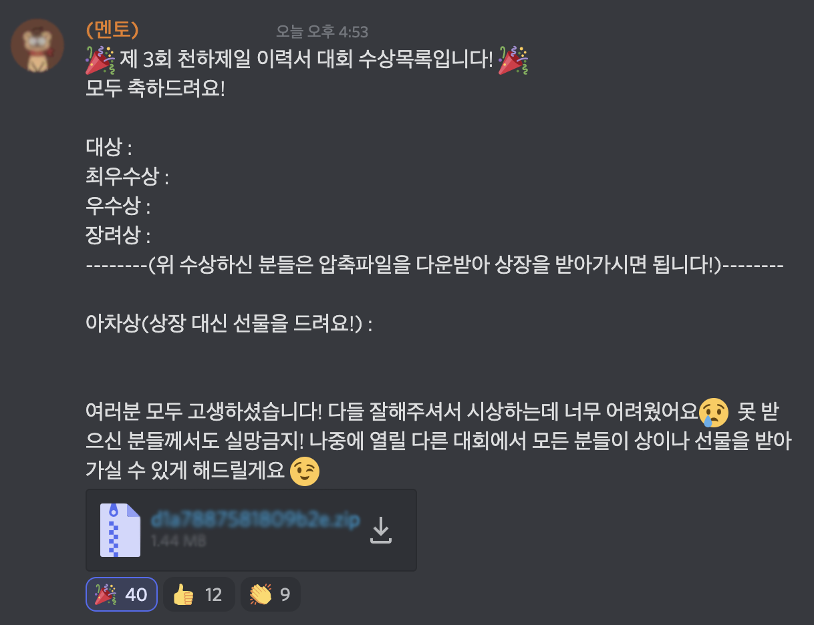

# 11/24 요약
- Server
- Sass/Scss

## 오늘 한 일
1. Server 수업 (이호준 강사님)

- 리눅스 구조와 특징 : Debian 계열, Redhat 계열, 슬랙웨어
-  터미널 명령어 : unzip, zip, apt-get install, nslookup, ping, traceroute, curl -o 등
-  터미널 명령어 퀴즈 : 거의 다 맞았다.
-  권한 : rws
-  실제 서비스 런칭 프로세스 : URL 구매 - https 인증서 발급 - URL과 서버 연결

2. Sass/Scss 수업 (이호준 강사님)
-  작동 원리 : CSS로 컴파일
-  파일 분리 및 주석 : 언더스코어(_)가 앞에 붙으면 컴파일하지 않음
-  Nesting : 속성 nesting, 앰퍼샌드(&), @at-root
-  변수 : $, lists, maps, scope, operator
-  Mixin : @mixin, @include, @content
-  Extend : @extend, %placeholder

3. 조은님 특강

4. 복습 : CSS - 9. position

## 오늘 배운/느낀 것
- 이력서 대회에서 아차상을 받았다! 별건 아니지만 기분 좋고 선물이 뭘까 두근두근,,, ^^

- 오늘 새로운 내용을 많이 배워서 머리가 좀 어질하긴 했지만, 프로그래밍 언어를 좀 공부했어서 그런지 Scss의 nesting, 변수, mixin, extend 등의 개념을 이해하는 것이 어렵지 않았다.
- Scss는 너무 재밌다! 계속 CSS의 코드 작성 방식과 가독성이 마음에 안들었는데, Scss는 가독성이 훨~씬 좋다. 근데 오늘 실습으로 과제 CSS를 Scss로 바꿔봤는데 코드 양이 별로 안..줄었다..? 하다보면 늘겠지? 😅
- Scss에서 앰퍼샌드를 두번 써봤는데 이 경우 작동하지 않았다. 앰퍼샌드는 맨 앞에서 한 번만 쓸 수 있는 건가? 내일 멘토님에게 여쭤봐야겠다.
```Scss
// didn't work
li {
    color: black;
    & + & {
    	color: red;
    }
}
```
```Scss
// works
li {
    color: black;
    & + li {
    	color: red;
    }
}
```

## 내일 할 일
- 아침 일찍 일어나서 도서관가기 (전기세 절약, 아침에 정신차리기)
- 복습
- 알고리즘 문제 풀기